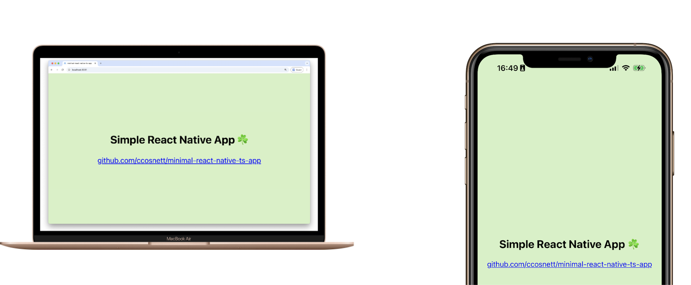

# Minimal React Native TypeScript App

A minimal React Native app in **TypeScript** that runs on **web**, **Android**, and **iOS** using [Expo](https://expo.dev).

## Screenshot

Running on web and iPhone via Expo Go:

<p align="center">
  
</p>

## Prerequisites

- [Node.js](https://nodejs.org/) (LTS recommended)

## Quick Start

```sh
npm install
npx expo start
```

## Run on Your iPhone

1. Install the [Expo Go](https://apps.apple.com/app/expo-go/id982107779) app on your iPhone
2. Start the development server:
   ```sh
   npm install
   npx expo start
   ```
3. Scan the QR code that appears in your terminal using your iPhone camera
4. The app will open in Expo Go

## Run on a Specific Platform

```sh
npx expo start --web       # Web browser
npx expo start --android   # Android (Expo Go or emulator)
npx expo start --ios       # iOS (Expo Go or simulator, macOS only)
```

## Production Builds

```sh
npx expo export --platform web   # Web
npx eas build --platform android # Android (requires EAS)
npx eas build --platform ios     # iOS (requires EAS)
```

## Project Structure

```
minimal-react-native-ts-app/
├── App.tsx         — Single-screen app component (TypeScript)
├── index.ts        — Entry point
├── app.json        — Expo config
├── tsconfig.json   — TypeScript configuration
├── package.json    — Dependencies (expo, react, react-native, typescript)
└── assets/         — Icons, splash image, favicon
```
